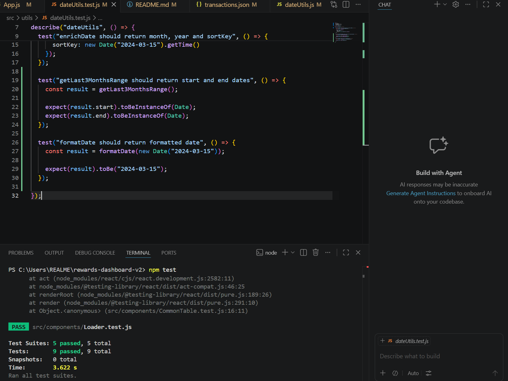
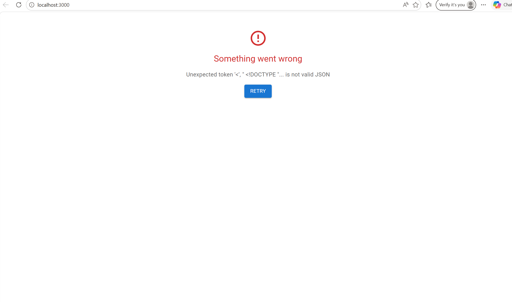
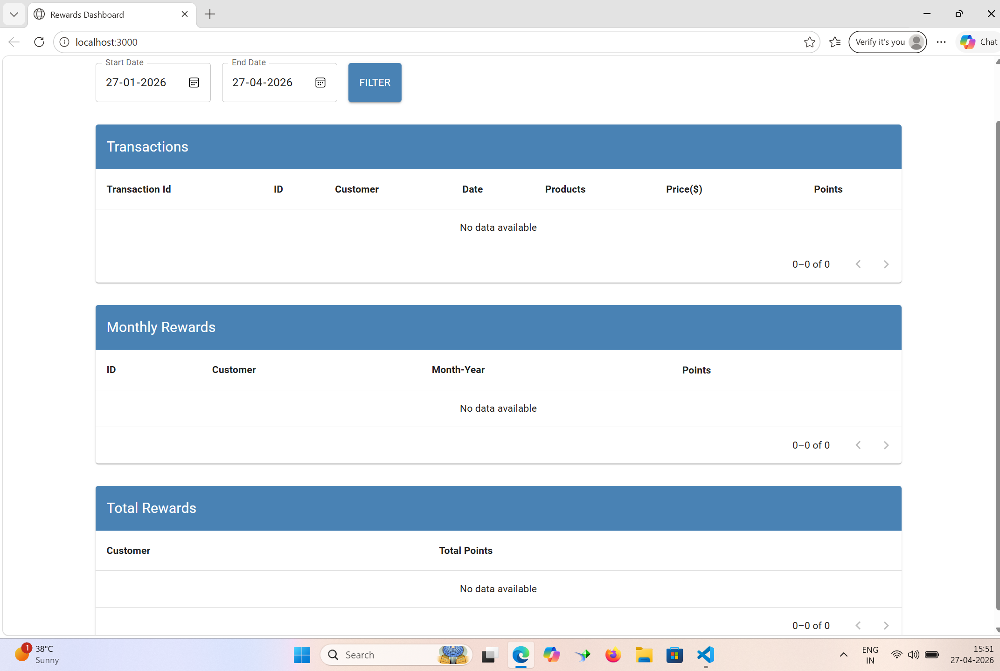
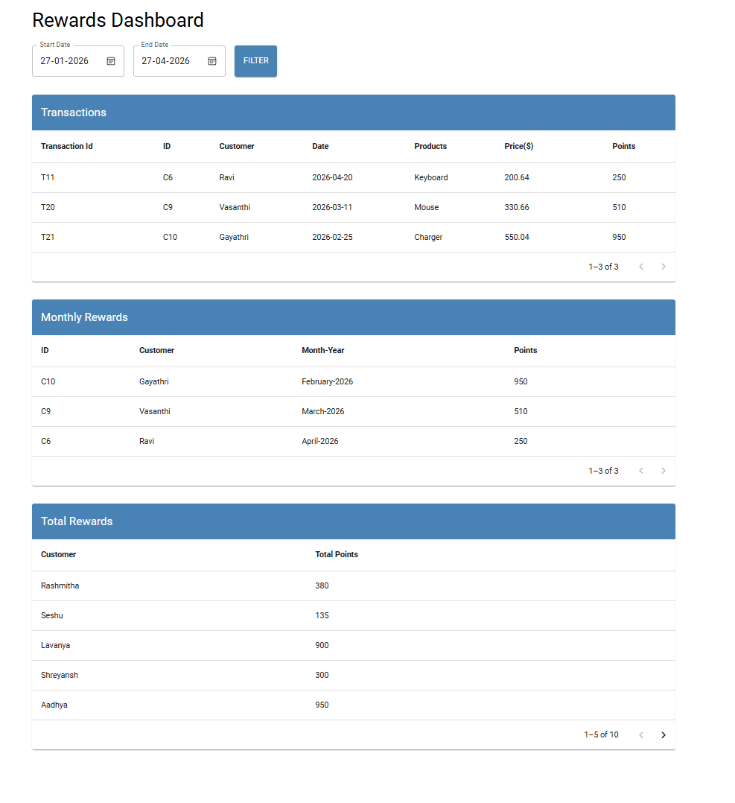
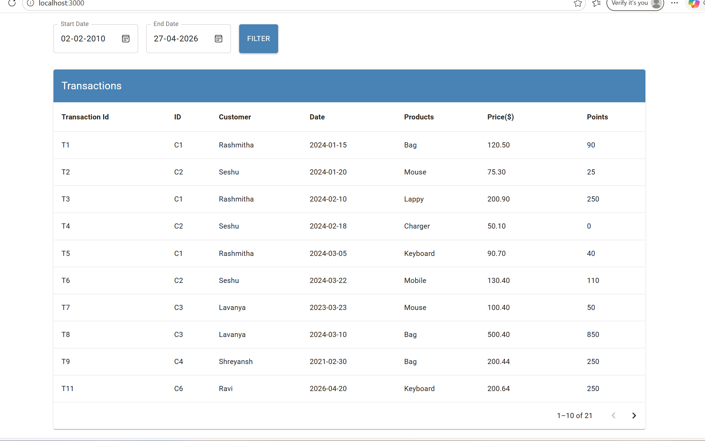
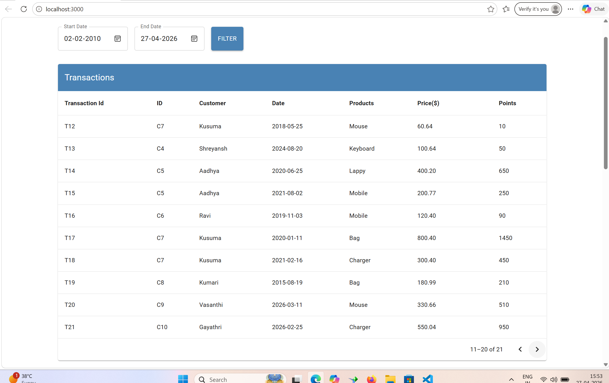
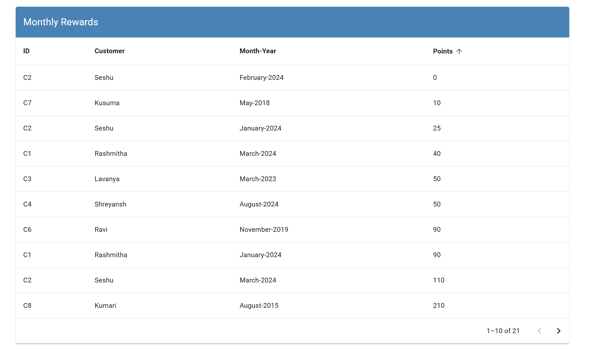
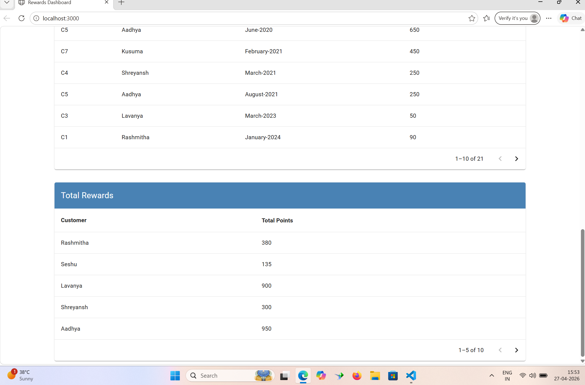

# Rewards Dashboard

A React-based dashboard to calculate and display customer reward points based on transactions.

---

# Features

- Calculate reward points based on transaction amount
- Group rewards by customer
- Monthly rewards tracking
- Reusable components (Table, Loader)
- Custom hook for data handling
- Unit test coverage

---

# Tech Stack

- React
- JavaScript (ES6+)
- Jest + React Testing Library

---

# Project Structure

```
src/
  components/
    CommonTable.js
    Loader.js
  hooks/
    useRewardsData.js
  services/
    api.js
  utils/
    calculatePoints.js
    dateUtils.js
```

---

# Getting Started

# 1. Install dependencies

```bash
npm install
```

### 2. Run the app

```bash
npm start
```

### 3. Run tests

```bash
npm test
```

---

# Reward Points Logic

- No points for transactions < $50
- 1 point for every $1 spent over $50
- 2 points for every $1 spent over $100

Example:

```
Transaction: $120
Points = (120 - 100)*2 + (100 - 50)
       = 40 + 50
       = 90
```

---

# Test Coverage

- React components
- Custom hooks

---

#  Future Improvements

- Add charts for visualization

---

#  screenshots
- Test Case Result:


- Api Fails:


- No Data


- Last Three Months Data


- More Years Selected Date Filter


- Pagination


Monthly Rewards Table Sortfilter Points


- Totalrewards Table


---
